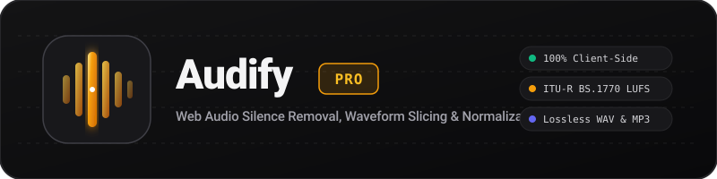

<p align="center">
  
</p>

<p align="center">
  <strong>Studio-Grade, 100% Client-Side Web Audio Workstation</strong><br />
  Fast silence removal, batch loudness normalization (LUFS / EBU R128), and Telegram voice message conversion.
</p>

<p align="center">
  
  
  
  
  
</p>

---

## ⚡ Key Highlights & Modules

### 1. ✂️ Silence Slicer
- **Intelligent Pause & Silence Trimming:** Automatic speech detection with adjustable dB threshold, pre/post padding, and minimum duration filters.
- **Waveform Canvas Editor:** Interactive visualizer with split, duplicate, delete, nudge, and zoom controls.
- **Per-Segment Effects:** Custom pitch shifting, tempo stretching, and dynamic volume gain for each slice.

### 2. 🎚️ Voice Leveler (Loudness Intelligence)
- **Standardized Loudness Normalization:** Fully compliant with ITU-R BS.1770 & EBU R128 loudness measurement algorithms.
- **Broadcast & Platform Presets:** Target presets for Podcasts (`-16 LUFS`), YouTube/Streaming (`-14 LUFS`), and Broadcast TV/Radio (`-23 LUFS`).
- **Brickwall True Peak Limiter:** Automatic limiter guard ensuring no digital distortion or clipping occurs.
- **Detailed Spectral & Vocal Metrics:** Visual spectrum meter, dynamic range, and integrated LUFS analytics.

### 3. 🎙️ Telegram Voice Converter (TG Voice)
- **Direct Telegram Voice Formatting:** Converts any audio or video recording into native mono Opus `.ogg` voice notes.
- **High-Throughput Batch Processing:** Non-blocking background worker queue handling 100–300+ files smoothly without UI lockup.
- **Selective & Batch ZIP Export:** Per-file bitrate options, search/filtering, and instant ZIP archiving.

### 4. 🔒 100% Private & Offline
- All decoding, manipulation, analysis, and encoding are processed locally in your browser memory via the Web Audio API and WebAssembly.
- **Zero data or audio ever leaves your computer.**

---

## 💻 Requirements

- **Node.js:** `v18.0.0` or higher
- **Package Manager:** `npm`, `pnpm`, or `bun`
- **Supported Browsers:** Google Chrome, Mozilla Firefox, Apple Safari, Microsoft Edge

---

## 🚀 Getting Started

```bash
# 1. Clone the repository
git clone https://github.com/DreamJourneyBD/Audify.git
cd Audify

# 2. Install dependencies
npm install

# 3. Start local development server
npm run dev
```

Open [http://localhost:3000](http://localhost:3000) in your browser.

---

## 🛠️ Workflows

| Tool | Primary Action | Export Formats |
| :--- | :--- | :--- |
| **Silence Slicer** | Remove awkward pauses, breaths, and dead air from podcasts or lectures | MP3 (128–320 kbps), WAV (16/24-bit), ZIP |
| **Voice Leveler** | Match volume across multiple speakers or microphone tracks | Standardized WAV, High-Bitrate MP3, Batch ZIP |
| **TG Voice** | Convert voice memos, songs, or video clips to Telegram voice messages | Native Telegram Opus `.ogg`, Consolidated ZIP |

---

## 📦 Build & Deployment

To build the static distribution:
```bash
npm run build
```

To deploy to GitHub Pages:
```bash
npm run deploy
```

---

## 📄 License

This project is open source and available under the [MIT License](LICENSE).
